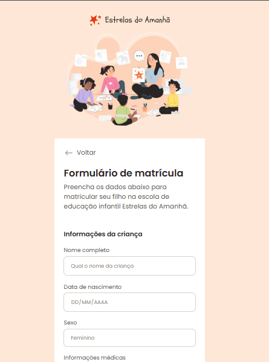

# 📝 Formulário de Matrícula - Rocketseat Challenge

Este projeto foi desenvolvido como parte de um desafio com foco em **responsividade** no curso Fullstack da Rocketseat.  
A proposta foi criar um formulário de inscrição simples e funcional, adaptável a diferentes tamanhos de tela.

## 📚 Descrição do projeto

O site apresenta:

- Um formulário de matrícula com campos como nome, e-mail, curso e data
- Layout centralizado, limpo e intuitivo
- Design responsivo que se adapta bem a desktop, tablet e mobile
- Feedback visual nos campos e botão

## 💻 Tecnologias utilizadas

- HTML5  
- CSS3  
- Flexbox  
- Media Queries para responsividade  
- Variáveis CSS e pseudo-classes

## 🌐 Acesse o projeto online

🔗 [Clique aqui para ver o site publicado](https://kauasilvandrade.github.io/RegistrationForm)

## 📸 Imagem do projeto

## 📌 Status do projeto

✅ Projeto finalizado e publicado com responsividade.

## ✍️ Autor

**Kauã da Silva Andrade**  
[LinkedIn](https://www.linkedin.com/in/kauã-andrade-6440a9225)  
[GitHub](https://github.com/kauasilvandrade)
